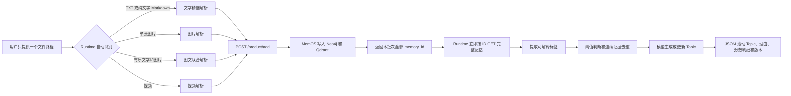

# MemOS 外部 Topic 系统与单文件导入设计

## 1. 最终结论

MemOS 继续负责解析和保存记忆。Topic 系统作为外部脚本，只读取 MemOS 已经生成的记忆。

Runtime 增加一个统一入口：用户只提供一个文件路径，Runtime 自动选择文字、图片、图文或视频解析路径。

Topic 不是一条 MemOS 记忆，也不需要单独的 Topic 数据库。当前 15 个滚动席位、候选证据和最近版本保存在一个可直接查看的 JSON 状态快照中；MemOS 仍是记忆的唯一事实来源。

## 2. 文件位置

- `scripts/memos_chat.py`：现有 Runtime，负责聊天和记忆导入。
- `scripts/memos_topic.py`：外部 Topic 处理器。
- `scripts/start_memos_topic.ps1`：Topic 处理器启动脚本。
- `.memos/topic/topics.json`：Topic、证据、分数明细和最近版本的默认状态快照。

JSON 不放在 `scripts` 目录，避免把运行状态和程序文件混在一起。旧的 `topics.db` 不会被覆盖或删除，但新流程不再读取它。

JSON 只缓存 Topic 需要的最小记忆字段：`memory_id`、记忆文字、状态、写入时间和 `info`。它不会复制 `sources`、图片 Base64、视频 Base64或其他大块原始媒体数据。

## 待完成任务

### 跨批次连续聊天截图聚合（待实现）

状态：待完成，当前不进入代码实现。

当前系统可以联合解析同一次 Markdown 导入中的多张连续截图，但多次单张上传之间不会自动回看和合并旧事件。后续需要增加独立的聊天事件整理流程：

1. 根据联系人、聊天应用、时间范围和顺序识别同一段连续聊天。
2. 去除相邻截图中重复出现的聊天内容。
3. 联合读取新记忆、同一聊天的旧事件和联系人摘要。
4. 按完整讨论、决定、计划或关系变化生成事件，不按截图数量生成事件。
5. 对结果明确执行“更新已有事件、新建事件或丢弃重复内容”之一。
6. 被合并的零碎事件保留证据引用，并从活动记忆中归档。
7. 联系人记忆继续引用整理后的最终事件 ID。

该任务不能直接通过开启 MemOS 的 Tree Reorganizer 代替，因为后者依赖向量聚类、主要创建父级摘要，并不负责跨批次聊天事件的精确合并。

## 3. 总体流程



## 4. 单文件导入规则

用户可以输入：

```powershell
:import "D:\memory-input\今天的记录.md"
```

也可以直接把文件拖进终端，随后按回车。

自动识别规则：

1. `.txt`、`.text`：读取文字，进入文字精细解析。
2. `.png`、`.jpg`、`.jpeg`、`.gif`、`.bmp`、`.webp`：进入单图解析。
3. `.md`、`.markdown`：
   - 没有图片：进入文字精细解析。
   - 只有一张图片且没有文字：进入单图解析。
   - 包含文字和图片，或者包含多张连续图片：保持原始顺序进入图文联合解析。
4. 支持的视频扩展名：进入现有视频解析。
5. 其他文件：明确报错，不猜测文件类型。

## 5. Topic 的理由结构

不再使用一条空泛的 `reason` 字符串。理由分成“总结”和“逐条证据”。

```json
{
  "topic_text": "用户近期正在集中准备期末考试。",
  "reason_summary": "考试时间已经明确，并且用户正在持续复习。",
  "reason_evidence": [
    {
      "memory_id": "memory-001",
      "fact": "用户查看了7月20日的考试日期和第三教学楼的考场。",
      "contribution": "证明考试时间和地点已经明确，考试正在临近。"
    },
    {
      "memory_id": "memory-002",
      "fact": "用户制定了连续三天复习高数真题的计划。",
      "contribution": "证明用户正在采取持续复习行动。"
    }
  ]
}
```

硬性规则：

- 每条证据必须有真实 `memory_id`。
- `fact` 必须来自对应记忆，不能编造。
- `contribution` 必须解释这条事实如何支持 Topic。
- 模型不能只写“多条记忆显示”而不列出具体证据。
- Topic 使用全部相关记忆进行综合，但理由可以列出其中最关键的证据。

## 6. 标签和连续证据去重

每条记忆最多生成 5 个标签。模型只做离散判断，不输出任何数字分数：

- `topic_key`：稳定的机器标识，例如 `final_exam`。
- `tag_name`：给用户看的中文名称，例如“期末考试”。
- `relationship`：只能是 `direct`、`related`、`weak`，分别表示直接证据、相关背景和弱关联。
- `initiative_type`：只能是 `initiated`、`acting`、`participated`、`observed`，分别表示主动发起、正在行动、参与其中和仅被动看到。
- `reason`：这条记忆为什么命中标签。

连续截图的全部记忆仍然保留，但同一个连续证据单元只计算一票：

1. 有 `event_group_id` 时，按 `event_group_id` 计票。
2. 否则有 `series_id` 时，按 `series_id` 计票。
3. 图片、图文或视频没有上述 ID 时，同一标签在 30 分钟窗口内只计算一次。
4. 普通独立文字记忆按 `memory_id` 单独计票。

每个证据单元只保留关系最直接的一票，但全部记忆 ID 都会进入证据列表。

## 7. 候选 Topic 公式

对同一个 `topic_key`，程序按固定表换算：

- 关系票：`direct = 1`、`related = 0.5`、`weak = 0`。
- 主动程度：`initiated = 1`、`acting = 0.75`、`participated = 0.4`、`observed = 0`。
- 状态：`ongoing = 1`、`planned = 0.7`、`uncertain = 0.3`、`completed = 0.2`、`cancelled = 0`。

满足下面任一条件，就成为候选 Topic：

```text
(独立证据单元 >= 2 且关系票之和 >= 1.5)
或者（用户主动发起，且事件为 planned 或 ongoing）
或者（事件时间已经到期，或在未来 7 天内）
```

每个候选条件都会作为中文 `candidate_reasons` 写入 JSON，可以直接看出它为什么获得候选资格。

## 8. 新鲜度和最终排名

基础分总计 100 分：

```text
证据分 30 = min(关系票之和 / 3, 1) × 30
主动分 25 = 最高主动程度权重 × 25
紧急分 20 = 按 event_time 距当前时间的固定档位换算
持续分 15 = min(出现证据的独立日期数 / 3, 1) × 15
状态分 10 = 最高状态权重 × 10
```

紧急分档位：24 小时内或已经到期为 20；1～3 天为 16；4～7 天为 12；8～30 天为 6；更远为 2；无事件时间为 0。已完成或已取消事件的紧急分为 0。

最后再乘以固定的新鲜度系数：

```text
24 小时内 = 1.00
1～3 天 = 0.90
4～7 天 = 0.75
8～30 天 = 0.50
30 天以上 = 0.25

rank_score = 基础分 × 新鲜度系数
```

`score_breakdown` 会完整保存以上每一项。模型只能生成 Topic 句子和证据说明，不能修改分数。

## 9. Topic 生成和更新机制

一条新记忆加入后：

1. Runtime 从 MemOS 成功响应中取得本批次全部 `memory_id`。
2. Runtime 立即按 ID 读取完整记忆，不经过待处理队列。
3. 为新记忆提取标签。
4. 重新生成受新证据影响的 Topic 句子，同时刷新所有候选的确定性新鲜度分数。
5. 取该标签跨越日期的全部有效相关记忆。
6. 重新生成 `topic_text`、理由和逐条证据。
7. 使用原来的 `topic_id`，版本号加一。
8. 保存更新前的完整版本。
9. 重新计算全局滚动 Top 15；午夜不会清空席位。

下列变化会触发版本更新：

- Topic 句子发生变化。
- 理由或关键证据发生变化。
- 支持记忆增加或减少。
- 事件时间、主动程度或状态发生变化。
- Topic 从候选进入 Top 15，或从 Top 15 被挤出。

## 10. Topic 淘汰机制

“淘汰”不是马上硬删除，而是改变生命周期状态，保留生成历史以便检查。

- `active`：位于当前滚动 Top 15，正常展示。
- `suppressed`：仍然达到候选阈值，但排名在 Top 15 之外；新证据到来后可以重新进入。
- `retired`：有效证据不足，或者来源记忆已经失效；不再展示。

具体规则：

1. 新 Topic 分数更高时，排名最低的 Topic 变为 `suppressed`。
2. MemOS 中的记忆被删除或归档后，执行 `reconcile`。
3. `reconcile` 将该记忆对应的标签票标记为失效。
4. Topic 使用剩余证据重新计算。
5. 如果不再满足候选阈值，Topic 变为 `retired`。
6. 日期不再隔离 Topic。过了午夜，昨天的 15 个席位继续保留；今天的新 Topic 分数更高时才把旧 Topic 挤到 `suppressed`。
7. 每个 Topic 在 JSON 的 `versions` 中最多保留最近 20 个旧版本；旧版本不参与排名。

## 11. 使用方法

启动 Runtime：

```powershell
cd D:\project-memo\MemOS
.\start_memos_chat.ps1
```

导入一个文件：

```text
:import "D:\memory-input\今天的记录.md"
```

默认不需要再启动第二个脚本。每次成功导入记忆后，Runtime 会自动完成：读取新记忆、提取标签、计算候选、生成或更新滚动 Topic，并在当前终端打印 Topic、理由和逐条记忆证据。

下面的独立命令只作为手动对账和排查工具保留。检查 MemOS 中已经删除或归档的来源记忆：

```powershell
.\start_memos_topic.ps1 run-once
```

也可以启动常驻对账监视器；它不会代替 Runtime 导入新记忆：

```powershell
.\start_memos_topic.ps1 watch
```

清理已经从 MemOS 删除或归档的来源记忆：

```powershell
.\start_memos_topic.ps1 reconcile
```

查看当前滚动 Topic：

```powershell
.\start_memos_topic.ps1 list --user default --cube default_cube
```

## 12. 模型配置

Topic 处理器优先读取：

```dotenv
TOPIC_API_BASE=https://dashscope.aliyuncs.com/compatible-mode/v1
TOPIC_API_KEY=你的百炼API密钥
TOPIC_MODEL=你的文字模型名称
```

如果没有这些配置，就复用 `CHAT_MODEL_LIST` 中的第一个模型。

真实 API 密钥只写入 `.env`，不能写进脚本、测试或设计文档。
